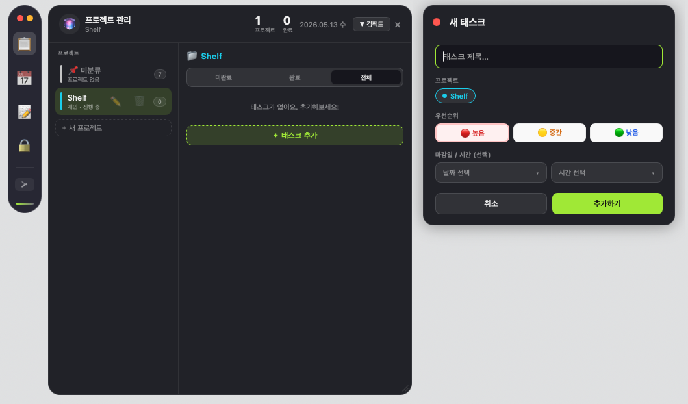
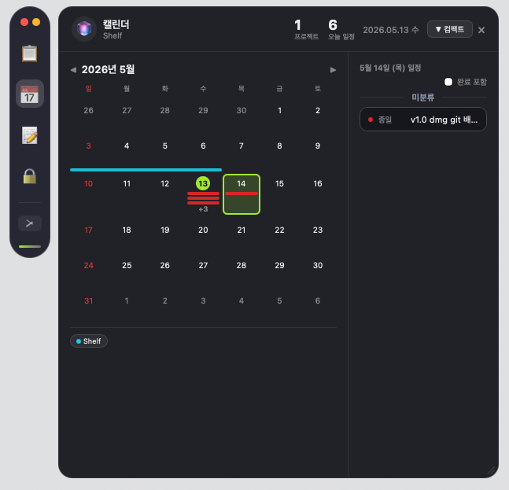
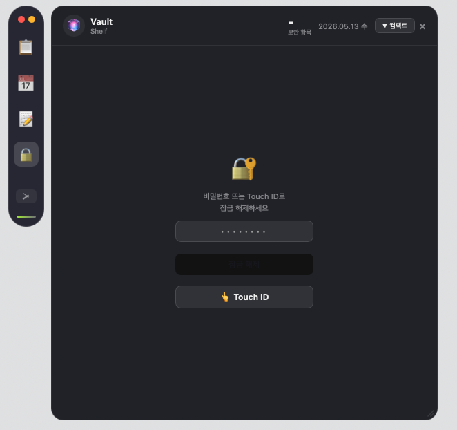
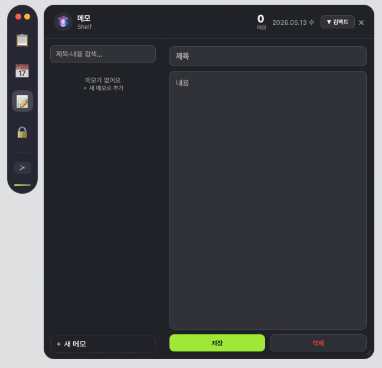

<div align="center">

# 🧲 Shelf

**A minimal floating workspace for macOS**

Always on top. Always out of the way.

[](https://github.com/devtaco30/shelf/releases/latest)
[](https://github.com/devtaco30/shelf/releases/latest)
[](LICENSE)

[한국어](README.ko.md)

<br/>



<br/>





</div>

---

## What is Shelf?

Shelf is a floating sidebar that lives on the edge of your screen. It stays on top of every window without getting in the way — a compact pill that expands into a full panel when you need it.

Tasks, calendar, encrypted vault, and memos. Everything in one place, always one click away.

---

## Features

**Tasks** — Create tasks with projects, priorities, and due dates. Organize everything into projects with color labels and track progress at a glance.

**Calendar** — View and create events in a clean monthly grid. Supports recurring schedules.

**Vault** — Encrypted storage for passwords and card information. Protected by AES-256 encryption and Touch ID. Your data never leaves your device.

**Memo** — A fast scratchpad for quick notes. No friction, no extra windows.

**Themes** — Dark Glass (dark panel, lime accent) and Soft Color (light panel, violet accent). Adjustable panel transparency.

---

## Download

→ **[Download the latest release](https://github.com/devtaco30/shelf/releases/latest)**

Download `Shelf_x.x.x_aarch64.dmg` (Apple Silicon) or `Shelf_x.x.x_x64.dmg` (Intel), open the DMG, and drag Shelf to your Applications folder.

> **First launch:** macOS may show a security warning since the app is not notarized.
> Right-click the app → **Open** → **Open** to allow it.

---

## Build from Source

**Requirements:** Node.js 18+, Rust (stable), macOS 12+

```bash
git clone https://github.com/devtaco30/shelf.git
cd shelf
npm ci
npm run tauri build
```

The built `.dmg` will be at `src-tauri/target/release/bundle/dmg/`.

**Development:**
```bash
npm run tauri:dev
```

---

## Tech Stack

- [Tauri 2](https://v2.tauri.app/) — Rust + WebView
- Vanilla JS / HTML / CSS — zero frontend framework
- SQLite — local data storage
- AES-256-GCM — vault encryption
- macOS Keychain + Touch ID — key management

---

## License

MIT
